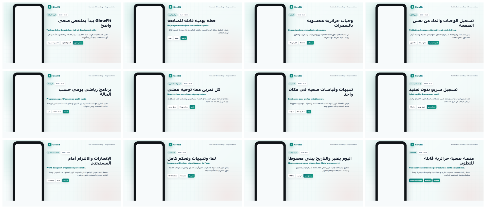
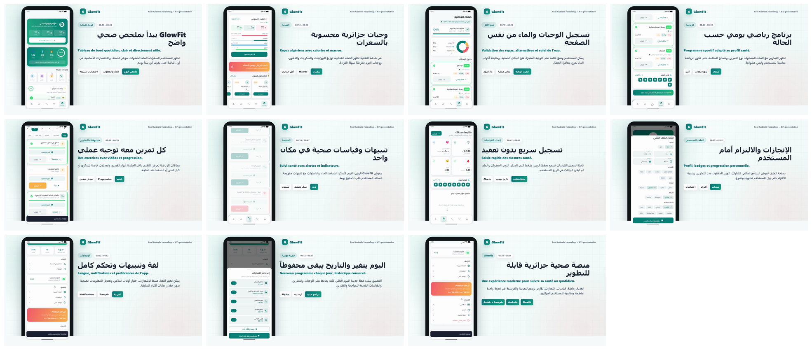

  
  <h1>GlowFit</h1>
  
<strong>تطبيق رقمي متكامل للصحة، التغذية والرياضة</strong>

  
منصة رقمية جزائرية تجمع المتابعة الصحية، الخطط الغذائية، البرامج الرياضية، والتنبيهات الذكية في تجربة واحدة.

  

    
    
    
  

  

    <a href="https://github.com/brahimkedjar/sihati_flutter/blob/brahim/showcase/glowfit_presentation_real_app.mp4"><strong>مشاهدة فيديو العرض</strong></a>
    &nbsp;|&nbsp;
    <a href="showcase/glowfit_real_app_contact_sheet.png"><strong>لقطات من التطبيق</strong></a>
  

## نظرة عامة

GlowFit يقدم تجربة موحدة لمتابعة الصحة اليومية، تنظيم الغذاء، إدارة البرامج الرياضية، وعرض مؤشرات التقدم داخل واجهة عربية واضحة ومناسبة للعرض الأكاديمي والمناقشة.

## لقطات من التطبيق

| الواجهة الرئيسية | شاشات حقيقية من التطبيق |
|---|---|
|  |  |

## المحاور الأساسية

- خطط غذائية وبرامج رياضية مهيأة حسب الهدف الصحي.
- متابعة الوزن، الماء، النوم، والنشاط اليومي.
- تنبيهات ومؤشرات تساعد المستخدم على الاستمرارية.
- تجربة عربية حديثة مع عرض مرئي مناسب للمشروع.

## فيديو العرض

- رابط مباشر: [glowfit_presentation_real_app.mp4](https://github.com/brahimkedjar/sihati_flutter/blob/brahim/showcase/glowfit_presentation_real_app.mp4)

## هيكلة العرض المرئي

- صفحة المشروع على GitHub: [brahimkedjar/sihati_flutter](https://github.com/brahimkedjar/sihati_flutter)
- ملفات العرض المرئي: [`showcase/`](showcase/)
